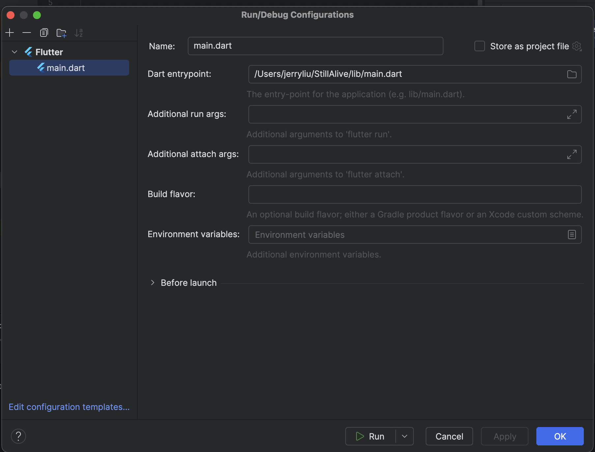

# StillAlive

## prerequisite

- Install android studio
	- Install `Flutter` plugin

- Install Flutter CLI

## Conf

- Android Studio project conf

## Ref

- https://github.com/yennanliu/todo_app_flutter
